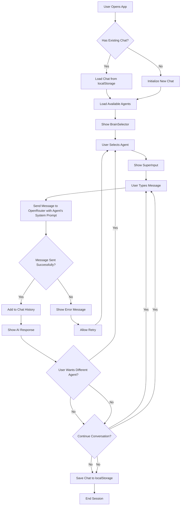

# Next.js Multi-Agent Conversation Application Development Plan

## Overview
This document outlines the development plan for a Next.js application that enables users to maintain a single, continuous conversation with multiple AI agents called "BRAINS." Users can switch between agents during the conversation. Each agent has distinct expertise defined by unique system prompts sent to OpenRouter. Users can request different services from various agents within the same chat history and create custom agents.

## Tech Stack
- Next.js (App Router)
- Zustand (State Management)
- Tailwind CSS (Styling)
- Lucide React (Icons)
- react-markdown (Markdown rendering for AI responses)
- localStorage (Persistence)
- OpenRouter API (AI Integration)

## Architecture

### Core Components
1. **BrainSelector** - Component to switch between different AI agents
2. **SuperInput** - Enhanced input component for user messages
3. **BrainChat** - Individual chat component for each agent
4. **ChatContainer** - Main container for the conversation history
5. **useChatStore** - Zustand store for managing chat state

### State Management (Zustand Store)
The application will use a single Zustand store to manage:
- Current active agent
- List of available agents
- Chat history with message metadata
- Conversation state
- User preferences

### Data Structure
```javascript
// Agent structure
{
  id: string,
  name: string,
  description: string,
  systemPrompt: string,
  createdAt: Date,
  isCustom: boolean
}

// Message structure
{
  id: string,
  content: string,
  role: 'user' | 'assistant',
  agentId: string,
  timestamp: Date,
  status: 'pending' | 'loading' | 'success' | 'error'
}

// Conversation structure
{
  id: string,
  title: string,
 messages: Message[],
  createdAt: Date,
  updatedAt: Date
}
```

## API Integration
- Integration with OpenRouter API for AI model access
- Each agent will have its own system prompt
- Messages will be sent with the appropriate system prompt based on the active agent
- Error handling for API failures

## Local Storage Implementation
- Persist chat history
- Store user-created agents
- Save user preferences
- Maintain conversation continuity across sessions

## Component Structure

### Main Components
```
app/
├── page.jsx (Main page)
├── layout.js (Root layout)
├── components/
│   ├── BrainSelector.jsx (Agent selection dropdown)
│   ├── SuperInput.jsx (Enhanced input component)
│   ├── Chats/
│   │   ├── index.jsx (Chat container)
│   │   └── BrainChat.jsx (Individual chat messages)
└── stores/
    └── useChatStore.js (Zustand store)
```

### BrainSelector Component
- Dropdown or list of available agents
- Option to create new custom agents
- Visual indication of active agent
- Ability to switch between agents

### SuperInput Component
- Text input with send button
- Agent selection for current message
- Keyboard shortcuts
- Message formatting options

### BrainChat Component
- Display messages in conversation format
- Different styling based on agent type
- Loading states for AI responses
- Error handling for failed requests

### Chat Container
- Scrollable message history
- Auto-scroll to latest message
- Conversation history persistence
- Message threading by agent

## Flowchart



## Development Phases

### Phase 1: Setup and Core Architecture
1. Set up Next.js project with Tailwind CSS
2. Install and configure dependencies (Zustand, Lucide React)
3. Create basic component structure
4. Implement Zustand store with basic state

### Phase 2: UI Implementation
1. Implement BrainSelector component
2. Implement SuperInput component
3. Implement BrainChat component
4. Style components with Tailwind CSS
5. Ensure UI remains unchanged as specified

### Phase 3: State Management
1. Implement chat history management
2. Implement agent switching functionality
3. Implement message threading by agent
4. Add loading and error states

### Phase 4: API Integration
1. Integrate with OpenRouter API
2. Implement system prompt handling per agent
3. Add error handling for API calls
4. Implement message streaming if supported

### Phase 5: Persistence
1. Implement localStorage for chat history
2. Implement localStorage for custom agents
3. Add data migration if needed
4. Implement data backup/restore

### Phase 6: Custom Agent Creation
1. Implement form for creating custom agents
2. Add validation for custom agents
3. Implement saving/loading of custom agents
4. Add UI for managing custom agents

### Phase 7: Testing and Optimization
1. Test multi-agent conversation flow
2. Test localStorage persistence
3. Optimize performance
4. Add accessibility features
5. Fix any UI/UX issues

## API Integration Details

### OpenRouter Configuration
- Use API key from environment variables
- Support multiple models per agent type
- Handle rate limiting and errors
- Implement proper request/response formatting

### Message Flow
1. User sends message with selected agent
2. App sends request to OpenRouter with:
   - User message
   - Selected agent's system prompt
   - Appropriate model selection
3. Receive and process AI response
4. Add response to chat history with agent metadata

## Error Handling Strategy
1. Network error handling
2. API error handling
3. Invalid agent selection handling
4. LocalStorage error handling
5. User-friendly error messages

## Performance Considerations
1. Optimize message rendering for long conversations
2. Implement virtual scrolling if needed
3. Optimize state updates to prevent unnecessary re-renders
4. Cache agent configurations
5. Implement proper cleanup of event listeners

## Security Considerations
1. Secure API key handling (server-side if possible)
2. Input sanitization
3. Rate limiting considerations
4. XSS prevention in message rendering